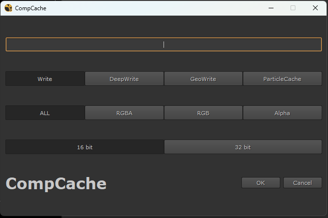

# 🐍 Python Project Name



## 📖 Description

This Python project is a [brief description of the project's purpose]. Its goal is to [briefly explain the problem it solves or the functionality it offers].

## ✨ Features

- 🐍 Feature 1
- 🐍 Feature 2
- 🐍 Feature 3

## 🚀 Installation

Clone the repository and use the following command to install the necessary dependencies:

```bash
pip install -r requirements.txt
```

## 🛠️ Usage

Explain how to use the project:

```python
import your_module

your_module.main_function()
```

## 🤝 Contributions

Contributions are welcome. Please open an issue or send a pull request to discuss any changes.

## 📝 License

This project is licensed under the MIT License. See the `LICENSE` file for more details.

## ✉️ Contact

For any inquiries, you can contact [your email].
